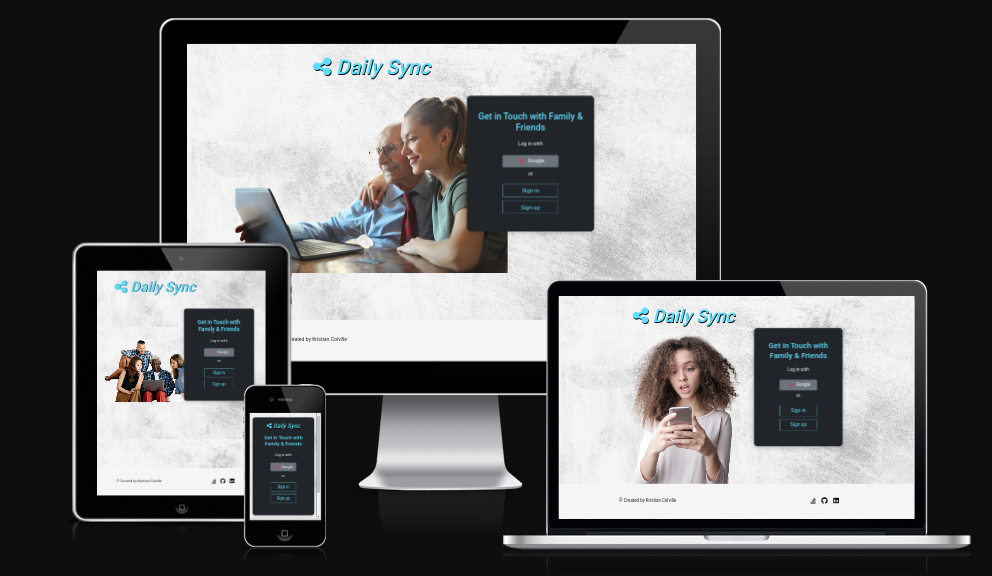
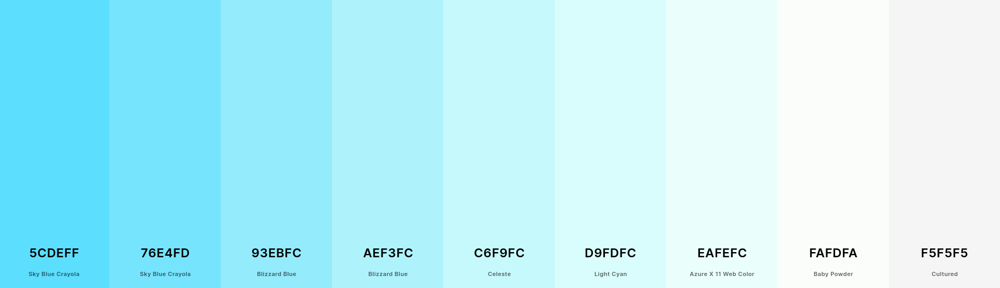
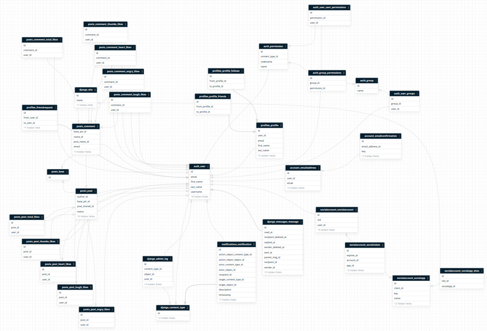
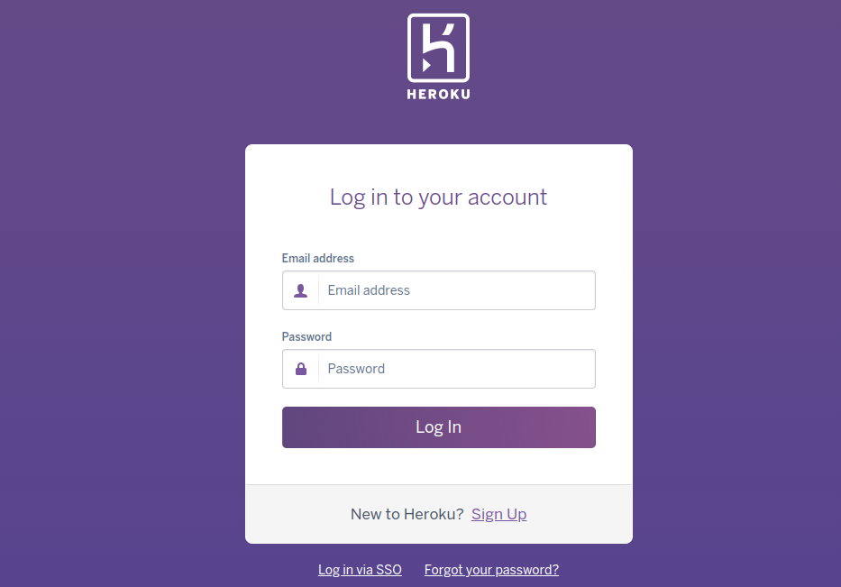
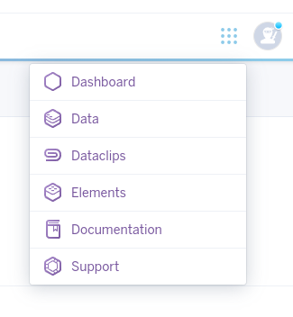
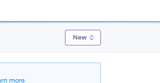
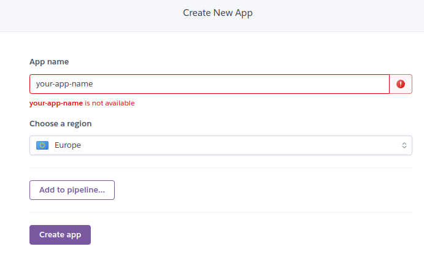
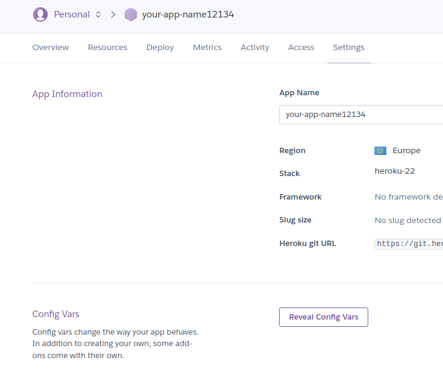
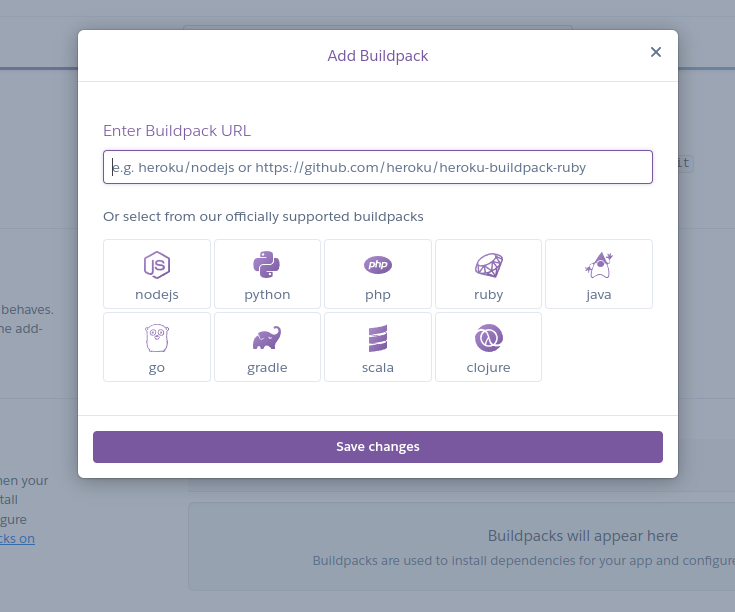
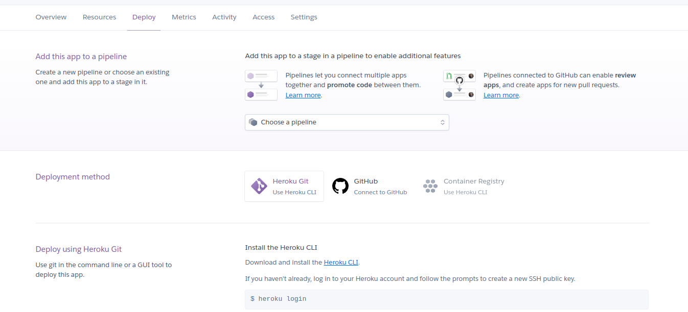

# Daily Sync

Developer: Kristian Colville

[Visit this website](https://daily-sync123.herokuapp.com/)

 

## Table of Contents

* [Project Goals](#project-goals)
    * [User Goals](#user-goals)
    * [Site Owners Goals](#site-owners-goals)
* [User Experience](#user-experience)
    * [Target Audience](#target-audience)
    * [User Requirements and Expectations](#user-requirements-and-expectations)
    * [User Stories](#user-stories)
* [Technologies & Tools](#technologies--tools)
* [Design](#design)
    * [Color Scheme](#color-scheme)
    * [Typography](#typography)
    * [Structure](#structure)
        * [Wireframes](#wireframes)
* [Information Architecture](#information-architecture)
    * [Database](#database)
    * [Data Modeling](#data-modeling)
* [Policy Pages](#policy-pages)
* [Features](#features)
* [Testing](#testing)
* [Validation](#validation)
* [Bugs](#bugs)
* [Development & Deployment](#deployment--deployment)
    * [Version Control](#version-control)
    * [Cloning this Repository](#cloning-this-repository)
    * [Heroku](#heroku)
* [Credits](#credits)
* [Acknowledgments](#acknowledgments)

## Project Goals

The goal of this project was to create a social media website that takes advantage of good UX design principles and can indicate to a global audience its purpose.

### User Goals

- Create a social media account on Daily Sync
- Add friends, expand a network and post content that reaches my network
- Have the ability to personalize a profile
- Have the ability to message friends and family
- Being able to keep in touch with lost contacts & create connections that last a lifetime

### Site Owners Goals

- Create a social media website that has the look and presentation of an experienced brand
- Allow users to use create, read, update and delete functionality throughout the website to keep people engaged in a meaningful and interactive way
- Provide authority for content that might offend or discriminate to ensure users that this is what a family-friendly social media website looks like
- Build a responsive and accessible website for a wide audience and build it with the latest tools and technology this world has to offer
- Bring attention to detail and provide a great user experience

[Back to Top](#table-of-contents)

## User Experience
### Target Audience

* Any user that wants to use another general-purpose social media website
* Users who would like to keep in touch with friends and family alike
* Users that are familiar with the user experience commonly seen on social media websites
* Users that enjoy having methods of interaction beyond the common text message
* People who enjoy writing meaningful content and are looking to express themselves
* Users that would like to share their daily interactions with the world
* People who enjoy having ways of personalizing their unique selves within a social environment

### User Requirements and Expectations

* Intuitive navigation throughout the website with a focus on simplicity
* Information is organized in a structured and easy-to-follow manner
* There should be feedback provided on most CRUD functionality used
* Help should be provided only if it does not interfere with the intuitive design
* Simplicity is paramount to a great social media site so any complexity should be minimized
* Any user should expect a reputable website to have a high degree of security to protect the user's personal information
* The website should provide ease of accessibility for visually impaired users
* The website should provide a sufficient amount of responsiveness for various devices used
* It's expected that any simplicity is correctly implemented to make sure that users can easily navigate around the website
* It's greatly expected as part of the user experience that any simplicity involved should provide multiple options that perform the same action to help users

### User Stories

| Issue ID | User Story |
|---|---|
|[#1](https://github.com/KristianColville1/daily-sync/issues/1)| As a user I can navigate around the website when I am logged in so that I find what I am looking for within the website |
|[#2](https://github.com/KristianColville1/daily-sync/issues/2)| As a new user I can identify the purpose of this website so that I can choose whether I want to sign up for this website if it interests me |
|[#3](https://github.com/KristianColville1/daily-sync/issues/3)| As a user I can create a post so that I can notify my network of my activity and share experiences |
|[#4](https://github.com/KristianColville1/daily-sync/issues/4) | As a new user I can create an account so that I can save my personal information and share it with my network |
|[#5](https://github.com/KristianColville1/daily-sync/issues/5)|As a returning user I can log in and access my account so that I can keep an account on this website|
|[#6](https://github.com/KristianColville1/daily-sync/issues/6)|As a user I can click on a post in order to view it differently so that I can expand the post and see additional information such as all the comments/ conversations within a post|
|[#7](https://github.com/KristianColville1/daily-sync/issues/7)|As a user I can create a comment on a post so that I can express myself and interact with my network|
|[#8](https://github.com/KristianColville1/daily-sync/issues/8)|As a user I can like or unlike a post so that I can share my opinion and appreciation for content on the website created by my network that I like|
|[#9](https://github.com/KristianColville1/daily-sync/issues/9)|As a registered user I can I can create my own profile so that I can share my personal information with my network and help others to identify me within the social media website|
|[#10](https://github.com/KristianColville1/daily-sync/issues/10)|As a registered user I can use a search mechanism so that I can find things like people or groups|
|[#11](https://github.com/KristianColville1/daily-sync/issues/11)|As a registered user I can add my friends so that I can contact them, and view their profiles and posts|
|[#12](https://github.com/KristianColville1/daily-sync/issues/12)|As a registered user I can quickly identify that I have new notifications so that I can act accordingly and respond to notifications like comments on a post, people liking my posts or messages from friends|
|[#16](https://github.com/KristianColville1/daily-sync/issues/16)| As a user I can check how many hours or days since a post was created so that I understand the time frame when a particular post was created and can identify between new and old content |
|[#17](https://github.com/KristianColville1/daily-sync/issues/17)| As a registered user I can upload a photo to use on my profile as a profile picture so that I can help others identify me on the network and have the ability to add more personalization |
|[#19](https://github.com/KristianColville1/daily-sync/issues/19)| As a user I can report a post to inform the admin of the site of content that might have bad intentions and be clearly identified as a misuse of the purpose of the website so that I can enjoy a pleasant experience on the website free from bad actors and possible malicious content |
|[#20](https://github.com/KristianColville1/daily-sync/issues/20)| As a registered user I can reset my password if forgot it so that I can access my account and have a good user experience |
|[#21](https://github.com/KristianColville1/daily-sync/issues/21)| As a registered user I can update a post I have created so that I can correct errors or add additional content to a post |
|[#22](https://github.com/KristianColville1/daily-sync/issues/22)| As a registered user I can delete a post or comment I have created so that I can personalize my experiences and remove content from my account that I might not want |
|[#24](https://github.com/KristianColville1/daily-sync/issues/24)| As the site owner I can use custom validation for user passwords so that I can increase the security of my website to improve GDPR compliance in providing good website security |
|[#26](https://github.com/KristianColville1/daily-sync/issues/26)| As a registered user I can edit a comment I created so that I can fix any errors in my comment or adjust it instead of starting from scratch with a new comment |
|[#27](https://github.com/KristianColville1/daily-sync/issues/27)| As a registered user I can be followed or follow other users so that I can keep up to date with profiles that I like or am interested in |
|[#29](https://github.com/KristianColville1/daily-sync/issues/29)| As a registered user I can change the colours of the website so that I can view the website in dark mode and lessen the strain on my eyes when using the website at later hours |
|[#30](https://github.com/KristianColville1/daily-sync/issues/30)| As a registered user I can like a post but have different emoji options available so that I can better express my feelings towards a post |
|[#31](https://github.com/KristianColville1/daily-sync/issues/31)| As a registered user I can like a comment on a post but have different emoji options available so that I can better express my feelings towards a comment I've read |
|[#32](https://github.com/KristianColville1/daily-sync/issues/32)| As the site owner I can provide various options for users to like posts and comments in different ways so that my users can interact in a more meaningful and creative way with each other |

[Back to Top](#table-of-contents)

## Technologies & Tools

- [Am I Responsive](http://ami.responsivedesign.is/) was used to generate an image showcasing the website's ability to adapt to different screen sizes at the start of this README.md file
- [Balsamiq](https://balsamiq.com/) was used to create wireframes for use during project development
- [Coolors](https://coolors.co/4e5340-697268-95a3a4-b7d1da-e2e8dd) to generate color palettes and root Hex codes
- [Chrome Developer Tools](https://developer.chrome.com/docs/devtools/) for making the site responsive and debugging the site in a browser
- [Favicon](https://favicon.io/) for the favicon in the website
- [Font Awesome](https://fontawesome.com/v5/search) for all icons within the website
- [Grammarly](https://app.grammarly.com/) for grammar and spell checking
- [Git](https://git-scm.com/) for version control within [VSCode](https://code.visualstudio.com/) to push commits to [GitHub](https://github.com/)
- [GitHub](https://github.com/) as a remote repository for project development
- [Google Fonts](https://fonts.google.com/) for the fonts used on the website
- [Jigsaw W3 Validator](https://jigsaw.w3.org/css-validator/) for validating CSS code
- [JShint](https://jshint.com/) for validating JavaScript code
- [Lighthouse](https://developers.google.com/web/tools/lighthouse) used within [Chrome Developer Tools](https://developer.chrome.com/docs/devtools/) for testing performance, accessibility, best practices, and search engine optimization
- [VSCode](https://code.visualstudio.com/) as a local repository
- [Wave Validator](https://wave.webaim.org/) for accessibility validation
- [WC3 Validator](https://validator.w3.org/) for validating HTML code

## Design
### Color Scheme

These colors were used in the design of this social media web app.

The colors bright blue to faded blue are among the colors used, in addition to white and white smoke. Black was also utilized to increase contrast. The fact that blue is the color most frequently used on social networking sites had an impact on the decision to select these colors. Consider Facebook or LinkedIn as examples

Blue's associations with dependability, strength, and reliability were also taken into account when making this design decision

### Typography

On the website, [Google Fonts](https://fonts.google.com/) were applied. Oswald and Lato were the fonts I initially used, but after receiving user input, I modified the website to utilize just one typeface because it had a greater level of aesthetic appeal.

- [Roboto font, created by Christian Robertson](https://fonts.google.com/specimen/Roboto)

Based on research into the types of fonts used by social media platforms, this font was selected. Google has introduced a reading-optimized robot-serif typeface, as can be seen [here](https://uk.pcmag.com/news/138808/google-introduces-reading-optimized-roboto-serif-typeface). This font needed to be neutral and welcoming while still offering the best reading experience on almost any device.

User comments showed that this was a great design decision for the online application when this font type was implemented.

### Structure
#### Wireframes

[Back to Top](#table-of-contents)
## Information Architecture
### Database

For the first migrations and testing during the development phases, SQLite was the main database. The main database was switched over to Postgres on Heroku when the project was deployed

### Data Modeling

An entity relationship diagram was made using [Trevor.io](https://trevor.io/) to model the connections between the various backend data structures

With the help of this tool, we can visualize the relationships between the data structures in a way that is both aesthetically beautiful and beneficial for comprehending the overall relationship between the data structures.

Through Heroku's add-ons, the technology was utilized to offer a rapid method of access.

We can quickly locate practically any relationship with the help of this information architecture. This is advantageous to use and work with from the perspective of a coder.

**Entity Relationship Diagram**
 

#### Models

In no particular order, these are the following models created for the Daily Sync web app.

1. Allauth User Model
* A model for all relationships that correspond to a individual user
* User model was built using [django-allauth](https://django-allauth.readthedocs.io/en/latest/installation.html) library
* When a new user is created a profile model is automatically assigned to the user

 

2. Profile Model

| Name | Database Key | Field Type | Validation |
|---|---|---|---|
|First_name|**first_name**|CharField|max_length=30, blank=True, null=True|
|Last_name|**last_name**|CharField|max_length=30, blank=True, null=True|
|Email|**email**|CharField|max_length=320, unique=True|
|Date of Birth|**d_o_b**|DateField|blank=True, null=True|
|Bio|**bio**|TextField|max_length=200, blank=True, unique=False|
|User|**user**|OneToOneField|User, on_delete=models.CASCADE, related_name='profile'|
|Avatar|**avatar**|CloudinaryField|'avatar', folder='avatars', null=True, blank=True|
|Background|**background**|CloudinaryField|'background', folder='backgrounds',  null=True, blank=True|
|Friends|**friends**|ManyToManyField|'self', blank=True, symmetrical=True, related_name='user_friends'|
|Follows|**follows**|ManyToManyField|'self', blank=True, symmetrical=False, related_name='user_followers'|
|Slug|**slug**|AutoSlugField|populate_from="user", unique=True|

 

3. Post Model

| Name | Database Key | Field Type | Validation |
|---|---|---|---|
| Author | **author** | ForeignKey | User, on_delete=models.CASCADE, related_name="user_posts", null=True |
|Title| **title**| TextField |max_length=200|
|Slug| **slug** | AutoSlugField |populate_from='title', unique_with='author'|
|Content| **content** | TextField |max_length=500|
|Created on| **created_on** | DateTimeField |auto_now_add=True|
|Updated on| **updated_on** | DateTimeField |auto_now_add=True|
|Edited| **edited** | BooleanField |default=False|
|Total likes| **total_likes** | ManyToManyField |User, related_name='post_likes', blank=True|
|Thumbs likes| **thumbs_likes** | ManyToManyField |User, related_name='thumb_likes', blank=True|
|Heart likes| **heart_likes** | ManyToManyField |User, related_name='heart_likes', blank=True|
|Laugh likes| **laugh_likes** | ManyToManyField |User, related_name='laugh_likes', blank=True|
|Angry likes| **angry_likes** | ManyToManyField |User, related_name='angry_likes', blank=True|
| Status| **status** | IntegerField |choices=STATUS, default=1|

 

4. Comment Model

| Name | Database Key | Field Type | Validation |
|---|---|---|---|
| Post | **post** | ForeignKey | Post, on_delete=models.CASCADE, related_name="comments" |
|Contributor| **contributor**| TextField |User, on_delete=models.CASCADE, related_name="comments", null=True|
|Name| **name** | CharField |max_length=100|
|Email| **email** | EmailField | none |
|Comment|**comment**| TextField | none |
| Created_on |**created_on**| DateTimeField | auto_now_add=True |
| Approved |**approved**| BooleanField | default=True |
|Total likes| **total_likes** | ManyToManyField |User, related_name='comment_likes', blank=True|
|Thumbs likes| **thumbs_likes** | ManyToManyField |User, related_name='thumb_likes', blank=True|
|Heart likes| **heart_likes** | ManyToManyField |User, related_name='comment_heart_likes', blank=True|
|Laugh likes| **laugh_likes** | ManyToManyField |User, related_name='comment_laugh_likes', blank=True|
|Angry likes| **angry_likes** | ManyToManyField |User, related_name='comment_angry_likes', blank=True|
| Status| **status** | IntegerField |choices=STATUS, default=1|

 

5. MessageManager Model

* Purpose: Automates the handling of the message objects like a physical postal service
* The email backend in 'daily_sync/settings.py' is configured with [Googles SMTP Server](https://support.google.com/a/answer/176600?hl=en)
* When a user sends a message on the deployed website an email is also sent to the receiver's email to alert them as well as the actual website
* Both MessageManager and Message models were acquired using the [django-messages](https://django-messages.readthedocs.io/en/latest/) module and adjusted for the needs of the project and errors in the PY version were corrected using the master branch from the source

 

6. Message Model

Django comes pre-built with a lot of security features and an encryption module was installed specifically to address the issue of private messaging other users.

- Cryptography for security in Django is implemented on this data model on the relevant fields
    - subject
    - body

| Name | Database Key | Field Type | Validation |
|---|---|---|---|
|Subject|**subject**|*encrypt(CharField())*|ugettext_lazy("Subject"), max_length=100)|
|Body|**body**|*encrypt(TextField())*|ugettext_lazy("Body"), max_length=1400)|
|Sender|**sender**|ForeignKey|AUTH_USER_MODEL,related_name='sent_messages',verbose_name=_("Sender"),on_delete=models.PROTECT|
|Recipient|**recipient**|ForeignKey|AUTH_USER_MODEL, related_name='received_messages', null=True, blank=True, verbose_name=_("Recipient"), on_delete=models.SET_NULL|
|Parent_msg|**parent_msg**|ForeignKey|'self', related_name='next_messages', null=True, blank=True, verbose_name=_("Parent message"), on_delete=models.SET_NULL|
|Sent_at|**sent_at**|DateTimeField|ugettext_lazy("sent at"), null=True, blank=True|
|Read_at|**read_at**|DateTimeField|ugettext_lazy("read at"), null=True, blank=True|
|Replied_at|**replied_at**|DateTimeField|ugettext_lazy("replied at"), null=True, blank=True|
|Sender_deleted_at|**sender_deleted_at**|DateTimeField|ugettext_lazy("Sender deleted at"), null=True, blank=True|
|Recipient_deleted_at|**recipient_deleted_at**|DateTimeField|ugettext_lazy("Recipient deleted at"), null=True, blank=True|
|Objects|**objects**|**MessageManager**||

 

[Back to Top](#table-of-contents)

## Policy Pages

A policy generator was used to build these policy pages. In the account settings app at the end of the index page, two links are shown, the terms and conditions and the privacy policy

- [Terms and Conditions](terms_and_conditions.md)

- [Privacy Policy](privacy_policy.md)

## Features
## Testing
## Validation

## Bugs

| Issue ID | Bug | Fix |
|---|---|---|
| [#13](https://github.com/KristianColville1/daily-sync/issues/13) |'auth.User.none' showing in place of where the number of likes should be Should be blank if not a number | Added count() to function call on count likes in post model to display a number |
| [#14](https://github.com/KristianColville1/daily-sync/issues/14) | An issue with migrating the comment model in posts/models.py. Planned to migrate new changes and it's refusing to do so because of the name field not having a default. My observation and knowledge tell me this is incorrect as I should not need a default on the name field | I found a simple fix from stack overflow suggesting deleting all migrations as this is a common issue encountered when working with django and to not delete the folder or __init__.py file and it solved the issue |
|[#15](https://github.com/KristianColville1/daily-sync/issues/15) | Unable to delete posts in admin after creating comment model | Temporally removed comment model and then deleted all posts and added back all comment modal data, comment post ID was causing the issue |
|[#18](https://github.com/KristianColville1/daily-sync/issues/18) | Unable to create a post that has the same title as a published post | I thought the issue was with the slug but after removing unique=true from the title variable in the post model this helped fix posting new posts with the same title but with a unique slug link |
|[#23](https://github.com/KristianColville1/daily-sync/issues/23)| When setting up the email backend and setting up an account or logging in the username and password fails | Used an addon service by heroku using a mailgun sandbox and separated development & production code so an smtp service is in place |
|[#25](https://github.com/KristianColville1/daily-sync/issues/25)| Keep getting 500 errors on sign up or login of new users | Reset local database and heroku database and migrated both and this fixed the issue |
|[#28](https://github.com/KristianColville1/daily-sync/issues/28)| Getting an index out of range error with the calc_time method for shorting the time since created | Removed a variable and adjusted the conditional logic for the first and last characters in the string and this fixed the bug |
|[#33](https://github.com/KristianColville1/daily-sync/issues/33)| For an unknown reason, the screen has two scroll bars if the vertical layout is longer than the screen height | Upon investigation I correctly assumed this was caused by bootstrap as I had used a different method of managing page overflow. I changed the overflow of the html and body element to visible and this fixed the issue |
|[#34](https://github.com/KristianColville1/daily-sync/issues/34)| I implemented a modal pop-up for creating posts through javascript and I can't create a post on the profile page because there's a csrf_token error | Added a csrf_token to the base template in order to catch it with javascript and use anywhere when creating posts |
|[#36](https://github.com/KristianColville1/daily-sync/issues/34)| Images are not being loaded by Heroku when deployed, and a server returns a 404 status on those images | Changed image paths, tested multiple outputs, adjusted code with no luck. I checked the documentation and I had django-heroku installed but not added and after setting up it loads the images. Added heroku settings local at bottom of settings.py in daily_sync directory |
|[#37](https://github.com/KristianColville1/daily-sync/issues/37)| The SMTP system has stopped working and users signing in from Heroku cannot get a verification email to create an account | I couldn't resolve the issue so I opted for an alternative route by using Googles SMTP and removed the Heroku add-on |

## Development & Deployment
### Version Control

I used [Visual Studio Code](https://code.visualstudio.com/) as a local repository and IDE & [GitHub](https://github.com/) as a remote repository.

1. Firstly, I needed to create a new repository on Github [daily-sync](https://github.com/KristianColville1/daily-sync).
2. I opened that repository on my local machine by copying the URL from that repository and cloning it from my IDE for use.
3. Visual Studio Code opened a new workspace for me.
4. I created files and folders to use.
5. To push my newly created files to GitHub I used the terminal by pressing Ctrl + shift + `.
6. A new terminal opened and then I used the below steps.

    - git add (name of the file) *This selects the file for the commit*
    - git commit -m "Commit message: (i.e. Initial commit)" *Allows the developer to assign a specific concise statement to the commit*
    - git push *The final command sends the code to GitHub*

### Cloning this Repository

If you would like to clone this repository please follow the bellow steps.

Instructions:

1. Log into GitHub
2. Navigate to the repository you want to clone
3. Click on the green button labelled 'Code'
4. Copy the URL under the HTTPS option
5. Open an IDE of your choosing that has Git installed
6. Open a new terminal window in your IDE
7. Type this exactly: git clone the-URL-you-copied-from-GitHub
8. Hit Enter

You should have a local copy of the repository to use on your machine.

If you encounter problems after cloning this project please make sure you have also installed the requirements to run this project

- Create a virtual environment by running the command in the terminal:
    - **python3 -m venv .venv**

- Activate your virtual environment by running the command:
    - **source .venv/bin/activate**

- Run the command to install these requirements:
    - **pip3 install -r requirements.txt**

Please see this [page](https://git-scm.com/book/en/v2/Git-Basics-Getting-a-Git-Repository) for a comprehensive walk-through and explanation of how to use Git and GitHub if you are unsure how to do so or if you encounter any more problems.

### Heroku

I selected [Heroku](https://dashboard.heroku.com) as a deployment option. As of the time of writing, it provides customers with a free tier, allowing them to quickly publish apps if they are just starting as developers

To deploy a project using Heroku follow these steps:

- Log into heroku

- Go to the heroku dashboard

- Create a new app by selecting 'New'

- Give your application a name and select a preferred location
    - The EU region was chosen for this application as the developer is located in this region

- Click the 'Create app' button

- If you have config variables in your application
    - Click on settings
    - Click 'Reveal config vars'
    - Input your deployment variables

- If you need specific build packs
    - Click on settings
    - Click on build pack
    - Add your packs as needed (Please be aware that the order matters)
    - No specific build packs were selected for this project as Django used.

- Once these steps are completed
    - Go to the deploy section
    - Select your version control system
    - For Daily Sync, GitHub was selected

- Connect your version control system
- Add your repository
- Connect the app selecting 'connect'
- Either choose automatic deployment or manual deployment
- Once all these steps are completed and the build is successful
    - You can click the 'view' button
    - It will reveal your deployed app
    
[Back to Top](#table-of-contents)

## Credits

[Creating Chat rooms](https://www.youtube.com/watch?v=F4nwRQPXD8w)

[Using Daphne on Heroku and setting up redis](https://www.youtube.com/watch?v=zizzeE4Obc0)

[Django Messages](https://django-messages.readthedocs.io/en/latest/) for django_messages module and updating to the [latest version](https://github.com/arneb/django-messages) allowed me to create a messaging system rapidly.

## Acknowledgments