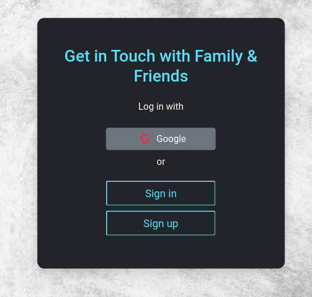

# Testing

## Manual Testing

As a means of testing functionality manual testing was carried out on the web application.

### Testing Usability

Using the method of acceptance testing by using multiple users to test different portions of the website.

| Testing | Actions | Expected results | Completed | Comments |
|---|---|---|---|---|
|Home Page|---|---|---|---|
|---| Load page | The page should load without errors |y|---|
|---|Icons visible|Clearly indicate icons|y|---|
|---|FeedBack provided| loads |y|---|
|Google Sign Up|---|---|---|---|
|---| Load page | The page should load without errors |y|---|
|---|Click on sign up button|Redirected to sign in|y|---|
|---|Verification notice |Email delivered|y|---|
|---|Buttons|Clicking produces result|y|---|
|---|FeedBack provided| loads |y|---|
|Sign Up|---|---|---|---|
|---|Click on sign up button|Redirected to sign up|y|---|
|---|Entering Details|Inputs fields should work |y|---|
|---|Verification notice |Email delivered|y|---|
|---|Buttons|Clicking produces result|y|---|
|---|FeedBack provided| loads |y|---|
|Sign In|---|---|---|---|
|---|Click on sign up button|Redirected to sign in|y|---|
|---|Entering Details|Inputs fields should work |y|---|
|---|Forgotten Password |Verification Code delivered|y|---|
|---|Buttons, Links|Clicking produces action|y|---|
|---|FeedBack provided| loads |y|---|
|Nav|---|---|---|---|
|---|Dropdown|Dropdown menu slides menu down and up |y|---|
|---|Buttons, Links|Clicking produces action|y|---|
|---|Icons visible|Clearly indicate icons|y|---|
|---|---|---|---|---|
|settings|---|---|---|---|
|---|Entering Details|Inputs fields should work |y|---|
|---|Buttons, Links|Clicking produces action|y|---|
|---|FeedBack provided| loads |y|---|
|Feed|---|---|---|---|
|---| Load page | The page should load without errors |y|---|
|---|Entering Details|Inputs fields should work |y|---|
|---|Create Post|Modal pop-up |y|---|
|---|Share Post|Modal pop-up |y|---|
|---|Dropdown|Dropdown menu slides menu down and up |y|---|
|---|Buttons, Links|Clicking produces action|y|---|
|---|Icons visible|Clearly indicate icons|y|---|
|Profile|---|---|---|---|
|---| Load page | The page should load without errors |y|---|
|---|Entering Details|Inputs fields should work |y|---|
|---|Create Post|Modal pop-up |y|---|
|---|Dropdown|Dropdown menu slides menu down and up |y|---|
|---|Buttons, Links|Clicking produces action|y|---|
|---|Icons visible|Clearly indicate icons|y|---|
|Other Profile|---|---|---|---|
|---| Load page | The page should load without errors |y|---|
|---|Share Post|Modal pop-up |y|---|
|---|Buttons, Links|Clicking produces action|n|---|
|---|Icons visible|Clearly indicate icons|y|---|
|View Post|---|---|---|---|
|---| Load page | The page should load without errors |y|---|
|---|Entering Details|Inputs fields should work |y|---|
|---|Create comment|Modal pop-up |y|---|
|---|Buttons, Links|Clicking produces action|y|---|
|---|Icons visible|Clearly indicate icons|y|---|
|Chat Rooms|---|---|---|---|
|---| Load page | The page should load without errors |y|---|
|---|Entering Details|Inputs fields should work |y|---|
|---|Buttons, Links|Clicking produces action|y|---|
|---|Icons visible|Clearly indicate icons|y|---|
|Messages|---|---|---|---|
|---| Load page | The page should load without errors |y|---|
|---|Entering Details|Inputs fields should work |y|---|
|---|Email user |Delivery of Message to Email Address supplied |y|---|
|---|Buttons, Links|Clicking produces action|y|---|
|---|Icons visible|Clearly indicate icons|y|---|
|Notifications|---|---|---|---|
|---|Dropdown|Dropdown menu slides menu down and up |y|---|
|---|Email user |Delivery of Message to Email Address supplied |y|---|
|---|Buttons, Links|Clicking produces action|y|---|
|---|Icons visible|Clearly indicate icons|y|---|
|Search|---|---|---|---|
|---| Load page | The page should load without errors |y|---|
|---|Entering Details|Inputs fields should work |n|---|
|---|Buttons, Links|Clicking produces action|n|---|
|---|Icons visible|Clearly indicate icons|y|---|

 

### Testing User Stories

1. 
|Issue ID|User Story|
|---|---|
|[#1](https://github.com/KristianColville1/daily-sync/issues/1)|As a user I can navigate around the website when I am logged in so that I find what I am looking for within the website|

| Role | Requirement Met | Image |
|---|---|---|
|**user**| y |  |

 

2. 
|Issue ID|User Story|
|---|---|
|[#2](https://github.com/KristianColville1/daily-sync/issues/2)|As a new user I can identify the purpose of this website so that I can choose whether I want to sign up for this website if it interests me|

| Role | Requirement Met | Image |
|---|---|---|
|**new user**| y | |

 

3. 
|Issue ID|User Story|
|---|---|
|[#3](https://github.com/KristianColville1/daily-sync/issues/3)|	As a user I can create a post so that I can notify my network of my activity and share experiences|

| Role | Requirement Met | Image |
|---|---|---|
|**user**| y | |

 

4. 
|Issue ID|User Story|
|---|---|
|[#4](https://github.com/KristianColville1/daily-sync/issues/4)|As a new user I can create an account so that I can save my personal information and share it with my network|

| Role | Requirement Met | Image |
|---|---|---|
|**new user**| y |  |

 

5. 
|Issue ID|User Story|
|---|---|
|[#5](https://github.com/KristianColville1/daily-sync/issues/5)| As a returning user I can log in and access my account so that I can keep an account on this website |

| Role | Requirement Met | Image |
|---|---|---|
|**Returning User**| y |  |

 

6. 
|Issue ID|User Story|
|---|---|
|[#6](https://github.com/KristianColville1/daily-sync/issues/6)| As a user I can click on a post in order to view it differently so that I can expand the post and see additional information such as all the comments/ conversations within a post |

| Role | Requirement Met | Image |
|---|---|---|
|**user**| y |  |

 

7. 
|Issue ID|User Story|
|---|---|
|[#7](https://github.com/KristianColville1/daily-sync/issues/7)|As a user I can create a comment on a post so that I can express myself and interact with my network|

| Role | Requirement Met | Image |
|---|---|---|
|**user**| y |  |

 

8. 
|Issue ID|User Story|
|---|---|
|[#8](https://github.com/KristianColville1/daily-sync/issues/8)|As a user I can like or unlike a post so that I can share my opinion and appreciation for content on the website created by my network that I like|

| Role | Requirement Met | Image |
|---|---|---|
|**user**| y | |

 

9. 
|Issue ID|User Story|
|---|---|
|[#9](https://github.com/KristianColville1/daily-sync/issues/9)|As a registered user I can I can create my own profile so that I can share my personal information with my network and help others to identify me within the social media website|

| Role | Requirement Met | Image |
|---|---|---|
|**registered user**| y | |

 

10. 
|Issue ID|User Story|
|---|---|
|[#10](https://github.com/KristianColville1/daily-sync/issues/10)|As a registered user I can use a search mechanism so that I can find things like people or groups|

| Role | Requirement Met | Image |
|---|---|---|
|**registered user**| n | - |

 

11. 
|Issue ID|User Story|
|---|---|
|[#11](https://github.com/KristianColville1/daily-sync/issues/11)|As a registered user I can add my friends so that I can contact them, and view their profiles and posts|

| Role | Requirement Met | Image |
|---|---|---|
|**registered user**| n | - |

 

12. 
|Issue ID|User Story|
|---|---|
|[#12](https://github.com/KristianColville1/daily-sync/issues/12)|As a registered user I can quickly identify that I have new notifications so that I can act accordingly and respond to notifications like comments on a post, people liking my posts or messages from friends|

| Role | Requirement Met | Image |
|---|---|---|
|**registered user**| y ||

 

13. 
|Issue ID|User Story|
|---|---|
|[#16](https://github.com/KristianColville1/daily-sync/issues/16)|As a user I can check how many hours or days since a post was created so that I understand the time frame when a particular post was created and can identify between new and old content|

| Role | Requirement Met | Image |
|---|---|---|
|**user**| y | |

 

14. 
|Issue ID|User Story|
|---|---|
|[#17](https://github.com/KristianColville1/daily-sync/issues/17)|As a registered user I can upload a photo to use on my profile as a profile picture so that I can help others identify me on the network and have the ability to add more personalization|

| Role | Requirement Met | Image |
|---|---|---|
|**registered user**| y |   |

 

15. 
|Issue ID|User Story|
|---|---|
|[#19](https://github.com/KristianColville1/daily-sync/issues/19)|As a user I can report a post to inform the admin of the site of content that might have bad intentions and be clearly identified as a misuse of the purpose of the website so that I can enjoy a pleasant experience on the website free from bad actors and possible malicious content|

| Role | Requirement Met | Image |
|---|---|---|
|**user**| n | - |

 

16. 
|Issue ID|User Story|
|---|---|
|[#20](https://github.com/KristianColville1/daily-sync/issues/20)|As a registered user I can reset my password if forgot it so that I can access my account and have a good user experience|

| Role | Requirement Met | Image |
|---|---|---|
|**registered user**| y | |

 

17. 
|Issue ID|User Story|
|---|---|
|[#21](https://github.com/KristianColville1/daily-sync/issues/21)|As a registered user I can update a post I have created so that I can correct errors or add additional content to a post|

| Role | Requirement Met | Image |
|---|---|---|
|**registered user**| y | |

 

18. 
|Issue ID|User Story|
|---|---|
|[#22](https://github.com/KristianColville1/daily-sync/issues/22)|As a registered user I can delete a post or comment I have created so that I can personalize my experiences and remove content from my account that I might not want|

| Role | Requirement Met | Image |
|---|---|---|
|**registered user**| y |  |

 

19. 
|Issue ID|User Story|
|---|---|
|[#24](https://github.com/KristianColville1/daily-sync/issues/24)|As the site owner I can use custom validation for user passwords so that I can increase the security of my website to improve GDPR compliance in providing good website security|

| Role | Requirement Met | Image |
|---|---|---|
|**site owner**| y | User feedback from forms|

 

20. 
|Issue ID|User Story|
|---|---|
|[#26](https://github.com/KristianColville1/daily-sync/issues/26)|As a registered user I can edit a comment I created so that I can fix any errors in my comment or adjust it instead of starting from scratch with a new comment|

| Role | Requirement Met | Image |
|---|---|---|
|**registered user**| y | |

 

21. 
|Issue ID|User Story|
|---|---|
|[#27](https://github.com/KristianColville1/daily-sync/issues/27)|As a registered user I can be followed or follow other users so that I can keep up to date with profiles that I like or am interested in|

| Role | Requirement Met | Image |
|---|---|---|
|**registered user**| y | notifies users on follow events using notify |

 

22. 
|Issue ID|User Story|
|---|---|
|[#29](https://github.com/KristianColville1/daily-sync/issues/29)|As a registered user I can change the colours of the website so that I can view the website in dark mode and lessen the strain on my eyes when using the website at later hours|

| Role | Requirement Met | Image |
|---|---|---|
|**registered user**| n | - |

 

23. 
|Issue ID|User Story|
|---|---|
|[#30](https://github.com/KristianColville1/daily-sync/issues/30)|As a registered user I can like a post but have different emoji options available so that I can better express my feelings towards a post|

| Role | Requirement Met | Image |
|---|---|---|
|**registered user**| y | |

 

24. 
|Issue ID|User Story|
|---|---|
|[#31](https://github.com/KristianColville1/daily-sync/issues/31)|As a registered user I can like a comment on a post but have different emoji options available so that I can better express my feelings towards a comment I've read|

| Role | Requirement Met | Image |
|---|---|---|
|**registered user**| y | |

 

25. 
|Issue ID|User Story|
|---|---|
|[#32](https://github.com/KristianColville1/daily-sync/issues/32)|As the site owner I can provide various options for users to like posts and comments in different ways so that my users can interact in a more meaningful and creative way with each other|

| Role | Requirement Met | Image |
|---|---|---|
|**site owner**| y | visit features section |

 

26. 
|Issue ID|User Story|
|---|---|
|[#35](https://github.com/KristianColville1/daily-sync/issues/35)|As a registered user I can send people private messages so that I can interact with people privately knowing any sensitive information is secured|

| Role | Requirement Met | Image |
|---|---|---|
|**registered user**| y | |