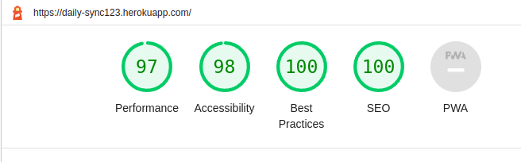
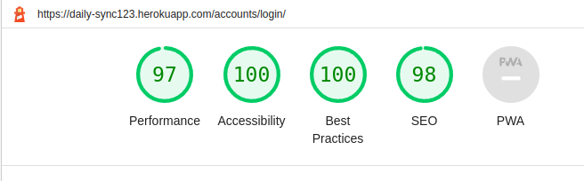
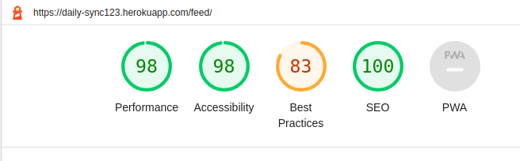
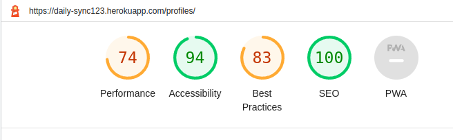
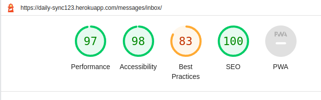
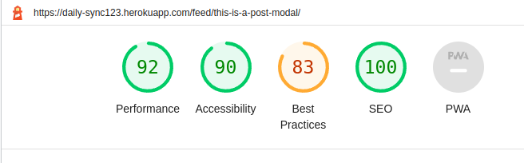
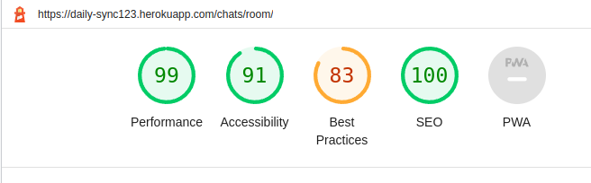
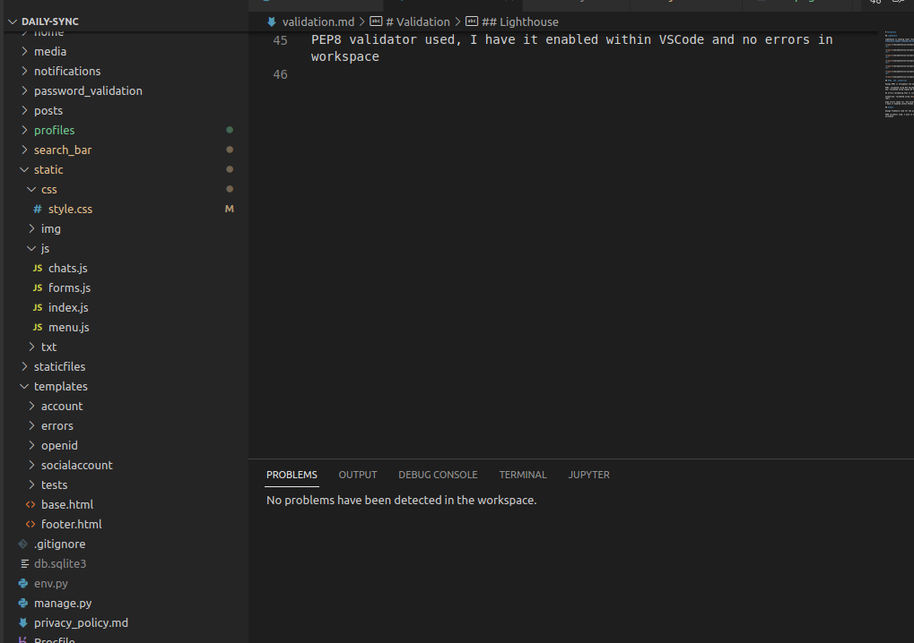

# Validation

## Lighthouse

Lighthouse is showing lower results for best practices because of the cloudinary images loading and not being the orignal resolution.

 

 

 

 

 

 

## HTML, CSS, JavaScript

Django HTML is throughout the website

HTML: validated using WC3 Validator
CSS: validated using Jigsaw W3 Validator

No errors validating html or css

JavaScript: validated using [Beautifytools.com](https://beautifytools.com/)

Some errors shown for 'Use esversion 6'.
I have it enabled within VSCode and theres no errors in the workspace

## Python

Django Framework used for the project.

PEP8 validator used, I have it enabled within VSCode and no errors in workspace

Pylint was also used as a linter within VSCode and enabled globally and there are no errors in any of the files within the workspace

